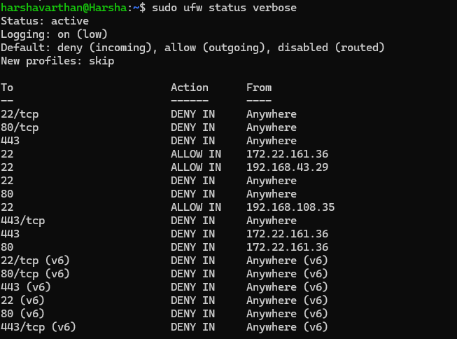

# Basic Firewall Setup Using UFW

## 1. Enable the Firewall
Command:
sudo ufw enable
# This command activates the Uncomplicated Firewall (UFW) on your system.

---

## 2. Check the Firewall Status
Command:
sudo ufw status verbose
# Displays the current firewall rules and settings.

📌 

---

## 3. Set Default Policies
Commands:
sudo ufw default deny incoming
# Blocks all incoming traffic by default.

sudo ufw default allow outgoing
# Allows all outgoing traffic, so the system can still access the internet.

📌 **Screenshot:** `screenshots/firewall_policies.png`

---

## 4. Allow SSH Access (Port 22) from a Specific IP
Command:
sudo ufw allow from <YOUR_IP> to any port 22
# Replace <YOUR_IP> with your actual IP address (found using 'hostname -I').

📌 **Screenshot:** `screenshots/allow_ssh.png`

---

## 5. Allow Web Traffic (HTTP & HTTPS)
Commands:
sudo ufw allow 80/tcp
# Allows traffic on port 80 (HTTP).

sudo ufw allow 443/tcp
# Allows traffic on port 443 (HTTPS).

📌 **Screenshot:** `screenshots/allow_http_https.png`

---

## 6. Verify Applied Firewall Rules
Command:
sudo ufw status verbose
# Checks if the firewall rules are correctly applied.

📌 **Screenshot:** `screenshots/firewall_status_after.png`

---

## 7. Test Firewall Using Nmap
Command:
nmap -p 22,80,443 <YOUR_IP>
# Scans the system to check which ports are open or closed.

📌 **Screenshot:** `screenshots/nmap_before.png` (Before applying firewall rules)  
📌 **Screenshot:** `screenshots/nmap_after.png` (After applying firewall rules)  

---

## 8. Block SSH Access (Port 22)
Command:
sudo ufw deny 22/tcp
# This command blocks SSH access.

📌 **Screenshot:** `screenshots/block_ssh.png`

---

## 9. Remove a Firewall Rule (Example: Delete SSH Rule)
Command:
sudo ufw delete allow 22/tcp
# Removes the rule that allowed SSH connections.

---

## 10. Disable the Firewall (If Needed)
Command:
sudo ufw disable
# Completely disables the firewall (not recommended for security reasons).

📌 **Screenshot:** `screenshots/disable_firewall.png`

---
