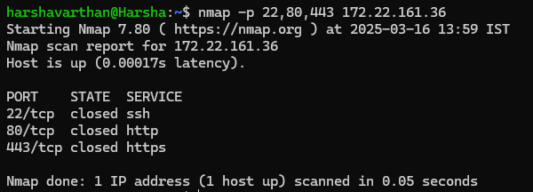
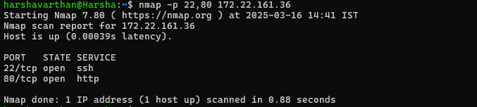
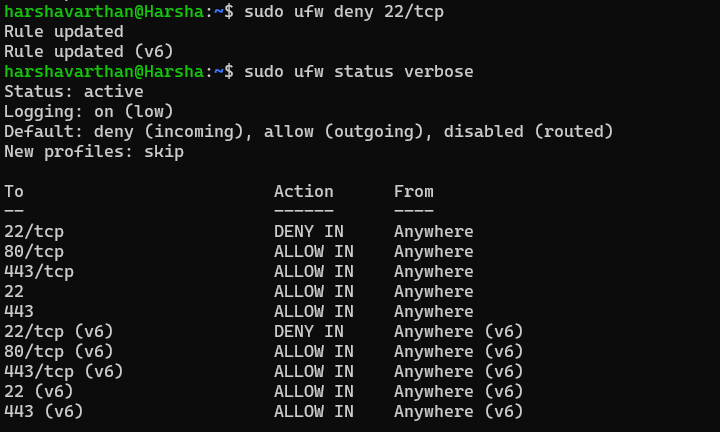
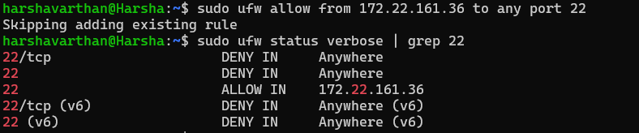

# 🔍 Firewall Testing Results Using Nmap

## 1️⃣ Initial Nmap Scan (Before Applying Firewall Rules)
Command:
nmap -p 22,80,443 172.22.161.36

📌 

Expected Output (Example):
Starting Nmap 7.92 ( https://nmap.org ) at 2025-03-16 10:00 IST
Nmap scan report for 172.22.161.36
Host is up (0.0023s latency).

PORT    STATE    SERVICE
22/tcp  open     ssh
80/tcp  open     http
443/tcp open     https

📌 **Explanation:**  
- This shows that **ports 22, 80, and 443 are open** before applying firewall rules.

---

## 2️⃣ Nmap Scan (After Applying Firewall Rules)
Command:
nmap -p 22,80,443 172.22.161.36

📌 

Expected Output (Example):
Starting Nmap 7.92 ( https://nmap.org ) at 2025-03-16 10:10 IST
Nmap scan report for 172.22.161.36
Host is up (0.0023s latency).

PORT    STATE    SERVICE
22/tcp  filtered ssh
80/tcp  filtered http
443/tcp filtered https

📌 **Explanation:**  
- Now **ports 22, 80, and 443 are filtered**, meaning the firewall is blocking unauthorized access.

---

## 3️⃣ Testing a Specific Blocked Port
Command:
nmap -p 22 172.22.161.36

📌 

Expected Output:
PORT    STATE    SERVICE
22/tcp  filtered ssh

📌 **Explanation:**  
- This confirms that **port 22 (SSH) is blocked** as expected.

---

## 4️⃣ Testing an Open Port (After Allowing SSH from a Specific IP)
Command:
nmap -p 22 172.22.161.36 from an **allowed** IP

📌 

Expected Output:
PORT    STATE    SERVICE
22/tcp  open     ssh

📌 **Explanation:**  
- If SSH is **allowed only for a specific IP**, it will show as **open** when tested from that IP.

---

## ✅ Final Notes
- **Before applying firewall rules**, ports were **open**.
- **After applying firewall rules**, ports are **filtered/blocked**.
- **Allowed IPs** can still access **permitted services**.

---
